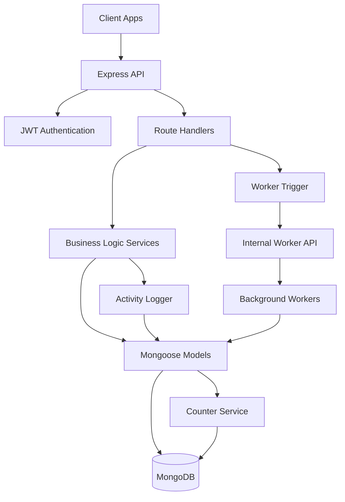

# Enhanced Task Management System

A comprehensive task management backend built with Node.js, Express, and MongoDB, featuring hierarchical sub-tasks, automated recurring task processing, and advanced audit capabilities.

## 🚀 Features

### Core Task Management
- ✅ **CRUD Operations** - Create, read, update, delete tasks
- ✅ **Hierarchical Sub-tasks** - Organize tasks with parent-child relationships
- ✅ **Recurring Tasks** - Automated daily, weekly, and monthly task generation
- ✅ **Priority & Categories** - Organize tasks by priority and custom categories
- ✅ **Due Date Tracking** - Original due date preservation and overdue detection

### Advanced Capabilities
- ✅ **Auto-Incremented IDs** - Sequential IDs across all collections for better UX
- ✅ **Background Workers** - Non-blocking recurring task processing
- ✅ **Activity Logging** - Comprehensive audit trail of all actions
- ✅ **Error Handling** - Robust error handling with retry mechanisms
- ✅ **Data Validation** - Comprehensive validation rules and constraints

### API Features
- ✅ **RESTful API** - Clean, consistent API design
- ✅ **Authentication** - JWT-based authentication with HTTP-only cookies
- ✅ **Filtering & Sorting** - Advanced query capabilities
- ✅ **Pagination** - Efficient data retrieval for large datasets
- ✅ **Internal APIs** - Secure worker endpoints for background processing

## 📋 Quick Start

### Prerequisites
- Node.js 18+ 
- MongoDB 5.0+
- npm or yarn

### Installation

```bash
# Clone the repository
git clone <repository-url>
cd enhanced-task-management/backend

# Install dependencies
npm install

# Set up environment variables
cp .env.example .env
# Edit .env with your configuration

# Start MongoDB (if running locally)
mongod

# Start the application
npm run dev
```

### Environment Variables

```bash
# Database
MONGODB_URL=mongodb://localhost:27017/task-app

# Authentication
JWT_SECRET=your-super-secret-jwt-key

# Server
PORT=3000
NODE_ENV=development

# Internal API (optional)
INTERNAL_API_KEY=your-internal-api-key

# Email (optional)
SENDGRID_API_KEY=your-sendgrid-key
```

## 🏗️ Architecture

### System Overview



### Key Components

| Component | Purpose | Location |
|-----------|---------|----------|
| **Models** | Data schemas and validation | `src/models/` |
| **Services** | Business logic layer | `src/services/` |
| **Routes** | API endpoint handlers | `src/routers/` |
| **Workers** | Background task processing | `src/workers/` |
| **Utilities** | Helper functions and tools | `src/utils/` |

## 📊 Data Models

### Task Model
```javascript
{
  taskId: Number,           // Auto-incremented ID
  userId: ObjectId,         // Owner reference
  title: String,            // Task title
  description: String,      // Optional description
  dueDate: Date,           // Due date
  originalDueDate: Date,   // Immutable original due date
  priority: String,        // "low" | "medium" | "high"
  category: String,        // Optional category
  isCompleted: Boolean,    // Completion status
  repeatType: String,      // "none" | "daily" | "weekly" | "monthly"
  parentTaskId: ObjectId,  // Parent task reference (sub-tasks)
  parentRecurringId: ObjectId, // Original recurring task reference
  links: [String],         // Related URLs
  additionalNotes: String, // Extended notes
  createdAt: Date,
  updatedAt: Date
}
```

### User Model
```javascript
{
  userId: Number,          // Auto-incremented ID
  name: String,            // User name
  email: String,           // Unique email
  password: String,        // Hashed password
  age: Number,             // Optional age
  emailEnabled: Boolean,   // Email notifications
  notificationTime: String, // Notification time (HH:MM)
  tokens: [Object],        // JWT tokens
  createdAt: Date,
  updatedAt: Date
}
```

## 🔧 API Endpoints

### Authentication
```http
POST /api/users/register    # Register new user
POST /api/users/login       # User login
POST /api/users/logout      # User logout
GET  /api/users/me          # Get current user
```

### Task Management
```http
POST   /api/tasks                    # Create task
GET    /api/tasks                    # Get tasks (with filters)
GET    /api/tasks/:id                # Get specific task
PATCH  /api/tasks/:id                # Update task
DELETE /api/tasks/:id                # Delete task
GET    /api/tasks/:id/hierarchy      # Get task with sub-tasks
GET    /api/tasks/:id/subtasks       # Get sub-tasks only
GET    /api/tasks/:id/recurring      # Get recurring instances
```

### Task Queries
```http
GET /api/tasks/today                 # Today's tasks
GET /api/tasks/overdue               # Overdue tasks
GET /api/tasks/priority/:priority    # Tasks by priority
GET /api/tasks/category/:category    # Tasks by category
```

### Query Parameters
```http
GET /api/tasks?completed=false&priority=high&limit=10&sortBy=dueDate:asc
```

## 🔄 Background Workers

### Recurring Task Processing

The system automatically handles recurring tasks through background workers:

1. **Task Creation**: When a recurring task is created, generates 3 future occurrences
2. **Task Completion**: When completed, updates next occurrence and generates new future instance
3. **Task Deletion**: When deleted, removes all related recurring instances

### Worker Endpoints (Internal)
```http
POST /internal/worker/tasks/recurrence  # Process recurring tasks
POST /internal/worker/tasks/cleanup     # Maintenance operations
GET  /internal/worker/health            # Health check
GET  /internal/worker/stats             # Statistics
```

## 📝 Activity Logging

All user actions and system events are automatically logged:

### Logged Activities
- Task creation, updates, completion, deletion
- User authentication events
- Recurring task processing
- System maintenance operations
- Error events

### Activity Query Examples
```javascript
// Get user's recent activities
GET /api/activities?limit=50&sortBy=timestamp:desc

// Get activities for specific task
GET /api/activities?taskId=123

// Get error activities
GET /api/activities?hasError=true
```

## 🧪 Testing

### Test Structure
```
tests/
├── integration/           # Integration tests
│   ├── recurringTaskLifecycle.test.js
│   ├── subTaskValidation.test.js
│   ├── workerProcessing.test.js
│   ├── activityLogging.test.js
│   └── counterService.test.js
├── unit/                  # Unit tests (simple tests)
│   ├── counterService.simple.test.js
│   ├── taskService.simple.test.js
│   ├── workerService.simple.test.js
│   └── errorHandling.simple.test.js
└── fixtures/              # Test data
```

### Running Tests
```bash
# Run all tests
npm test

# Run unit tests only
npm run test:unit

# Run integration tests only
npm run test:integration

# Run specific test file
npm run test:counter
```

## 🚀 Deployment

### Production Setup

1. **Environment Configuration**
```bash
NODE_ENV=production
MONGODB_URL=mongodb://your-production-db
JWT_SECRET=your-production-secret
INTERNAL_API_KEY=your-production-internal-key
```

2. **Process Management**
```bash
# Using PM2
npm install -g pm2
pm2 start ecosystem.config.js
```

3. **Database Indexes**
```javascript
// Ensure indexes are created
db.tasks.createIndex({ "userId": 1, "dueDate": 1 });
db.tasks.createIndex({ "parentTaskId": 1 });
db.tasks.createIndex({ "parentRecurringId": 1 });
db.useractivities.createIndex({ "userId": 1, "timestamp": -1 });
```

### Docker Deployment
```dockerfile
FROM node:18-alpine
WORKDIR /app
COPY package*.json ./
RUN npm ci --only=production
COPY src/ ./src/
EXPOSE 3000
CMD ["node", "src/index.js"]
```

## 📚 Documentation

Comprehensive documentation is available in the `documentation/` directory:

- **[API Documentation](documentation/API_DOCUMENTATION.md)** - Complete API reference
- **[Data Models](documentation/DATA_MODELS.md)** - Database schemas and relationships
- **[Worker System](documentation/WORKER_SYSTEM.md)** - Background processing documentation
- **[Counter & Logging](documentation/COUNTER_AND_LOGGING.md)** - ID generation and activity logging
- **[Authentication Guide](documentation/FRONTEND_AUTHENTICATION_GUIDE.md)** - Frontend integration guide

## 🔍 Monitoring

### Health Checks
```bash
# API health
curl http://localhost:3000/health

# Worker health
curl -H "x-internal-api-key: your-key" http://localhost:3000/internal/worker/health
```

### Key Metrics
- Task creation/completion rates
- Recurring task processing success rate
- API response times
- Error rates
- Database performance

### Logging
```bash
# Application logs
tail -f logs/app.log

# Error logs
tail -f logs/error.log

# Worker logs
tail -f logs/worker.log
```

## 🛠️ Development

### Project Structure
```
backend/
├── src/
│   ├── models/           # Mongoose models
│   ├── routers/          # Express routes
│   ├── services/         # Business logic
│   ├── workers/          # Background workers
│   ├── utils/            # Utility functions
│   ├── middleware/       # Express middleware
│   └── index.js          # Application entry point
├── tests/                # Test files
├── documentation/        # Documentation
└── package.json
```

### Code Style
- ESLint configuration for consistent code style
- Prettier for code formatting
- JSDoc comments for functions and classes

### Contributing
1. Fork the repository
2. Create a feature branch
3. Write tests for new functionality
4. Ensure all tests pass
5. Submit a pull request

## 🐛 Troubleshooting

### Common Issues

**Database Connection Issues**
```bash
# Check MongoDB status
systemctl status mongod

# Check connection string
echo $MONGODB_URL
```

**Worker Processing Issues**
```bash
# Check worker health
curl -H "x-internal-api-key: your-key" http://localhost:3000/internal/worker/health

# Check recent error logs
grep "WorkerService.*ERROR" logs/app.log | tail -10
```

**Authentication Issues**
```bash
# Verify JWT secret is set
echo $JWT_SECRET

# Check token expiration
# Tokens expire after 7 days by default
```

### Performance Optimization

1. **Database Indexes**: Ensure proper indexes are created
2. **Connection Pooling**: Configure MongoDB connection pool size
3. **Caching**: Implement Redis caching for frequently accessed data
4. **Background Processing**: Use worker queues for heavy operations

## 📈 Roadmap

### Planned Features
- [ ] Real-time notifications via WebSocket
- [ ] File attachments for tasks
- [ ] Team collaboration features
- [ ] Advanced reporting and analytics
- [ ] Mobile app API enhancements
- [ ] Integration with external calendars

### Performance Improvements
- [ ] Redis caching layer
- [ ] Database query optimization
- [ ] API response compression
- [ ] Background job queuing with Bull

## 📄 License

This project is licensed under the MIT License - see the [LICENSE](LICENSE) file for details.

## 🤝 Support

For support and questions:
- Create an issue in the GitHub repository
- Check the documentation in the `documentation/` directory
- Review the troubleshooting section above

## 🙏 Acknowledgments

- Express.js for the web framework
- Mongoose for MongoDB object modeling
- JWT for authentication
- All contributors and testers

---

**Built with ❤️ for efficient task management**