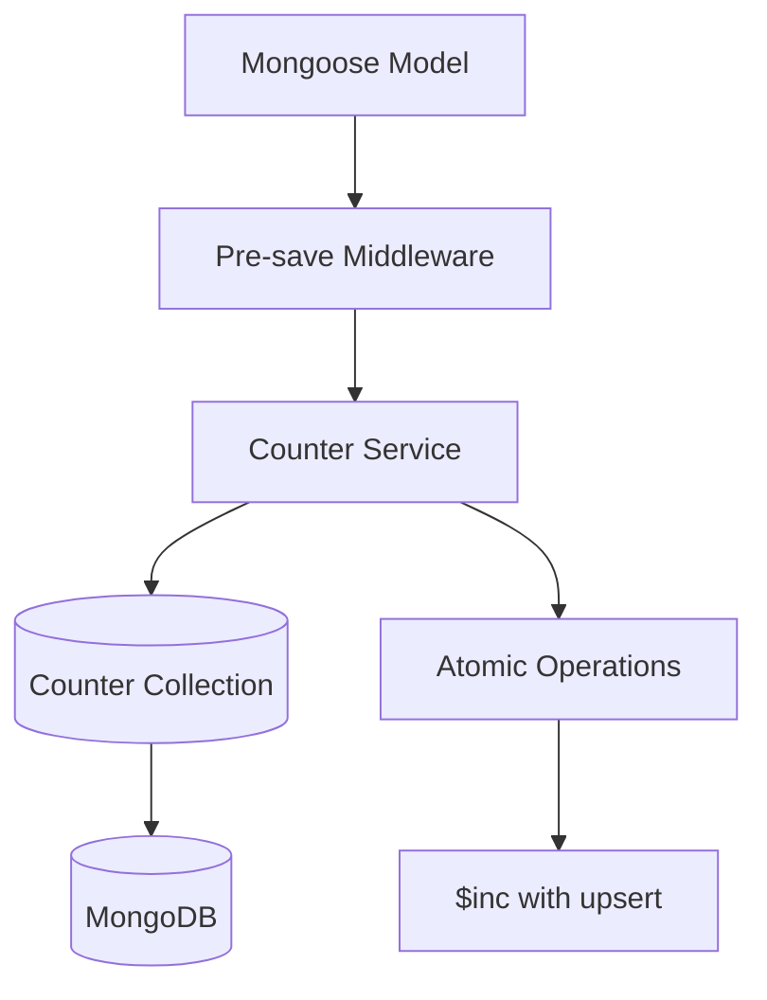
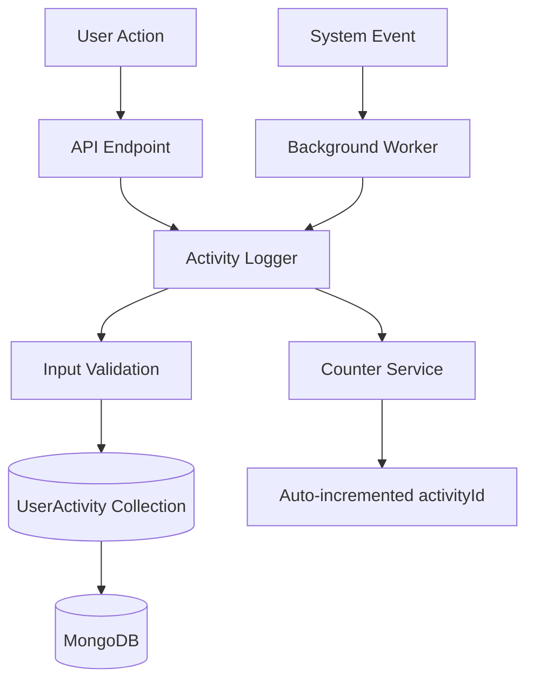

# Counter System and Activity Logging Documentation

## Overview

This document covers two critical systems in the Enhanced Task Management application:

1. **Counter System**: Provides auto-incremented sequential IDs for all collections
2. **Activity Logging**: Comprehensive audit trail of all user and system actions

Both systems are designed for high performance, data integrity, and scalability.

## Counter System

### Purpose

The Counter System replaces MongoDB's default ObjectId with predictable, sequential integer IDs for better user experience and inter-collection mapping. Each collection maintains its own independent counter sequence.

### Architecture



### Counter Collection Schema

```javascript
const counterSchema = new mongoose.Schema({
  _id: {
    type: String,
    required: true // Collection name (e.g., "tasks", "users")
  },
  sequence_value: {
    type: Number,
    default: 1,
    min: 1
  }
}, {
  versionKey: false
});
```

### Counter Documents Example

```javascript
// Counter documents in MongoDB
{
  "_id": "tasks",
  "sequence_value": 1247
}

{
  "_id": "users", 
  "sequence_value": 89
}

{
  "_id": "useractivities",
  "sequence_value": 5632
}
```

### Counter Service API

#### Core Methods

```javascript
class CounterService {
  /**
   * Get next sequence value atomically
   * @param {string} collectionName - Name of collection
   * @returns {Promise<number>} Next sequence value
   */
  static async getNextSequence(collectionName);
  
  /**
   * Initialize counter with custom start value
   * @param {string} collectionName - Name of collection  
   * @param {number} startValue - Starting value (default: 1)
   * @returns {Promise<boolean>} True if created, false if exists
   */
  static async initializeCounter(collectionName, startValue = 1);
  
  /**
   * Reset counter to specific value
   * @param {string} collectionName - Name of collection
   * @param {number} newValue - New counter value
   * @returns {Promise<number>} New counter value
   */
  static async resetCounter(collectionName, newValue = 1);
  
  /**
   * Get current counter value without incrementing
   * @param {string} collectionName - Name of collection
   * @returns {Promise<number|null>} Current value or null
   */
  static async getCurrentValue(collectionName);
  
  /**
   * Get all counters for monitoring
   * @returns {Promise<Array>} All counter documents
   */
  static async getAllCounters();
}
```

#### Usage Examples

```javascript
// Get next task ID
const taskId = await CounterService.getNextSequence('tasks');
// Returns: 1248

// Initialize counter for new collection
const created = await CounterService.initializeCounter('notifications', 100);
// Returns: true (counter created with start value 100)

// Reset counter (use with caution)
await CounterService.resetCounter('tasks', 2000);
// Counter reset to 2000, next ID will be 2001

// Check current value
const currentValue = await CounterService.getCurrentValue('users');
// Returns: 89 (without incrementing)
```

### Model Integration

#### Automatic ID Assignment

Each model includes pre-save middleware that automatically assigns sequential IDs:

```javascript
// Task model pre-save middleware
taskSchema.pre('save', async function(next) {
  try {
    // Assign taskId for new documents
    if (this.isNew && !this.taskId) {
      this.taskId = await CounterService.getNextSequence('tasks');
    }
    
    // Other validation logic...
    next();
  } catch (error) {
    next(error);
  }
});
```

#### Field Naming Convention

Each collection uses a specific field name for its auto-incremented ID:

| Collection | ID Field | Example |
|------------|----------|---------|
| tasks | `taskId` | 1, 2, 3, ... |
| users | `userId` | 1, 2, 3, ... |
| useractivities | `activityId` | 1, 2, 3, ... |
| notifications | `notificationId` | 1, 2, 3, ... |

### Atomic Operations

#### Race Condition Prevention

The Counter Service uses MongoDB's atomic `findOneAndUpdate` with `$inc` operator to prevent race conditions:

```javascript
static async getNextSequence(collectionName) {
  const counter = await Counter.findOneAndUpdate(
    { _id: collectionName },
    { $inc: { sequence_value: 1 } },
    { 
      new: true,        // Return updated document
      upsert: true,     // Create if doesn't exist
      runValidators: true
    }
  );
  
  return counter.sequence_value;
}
```

#### Concurrent Access Handling

```javascript
// Multiple concurrent requests
const promises = [];
for (let i = 0; i < 100; i++) {
  promises.push(CounterService.getNextSequence('tasks'));
}

const results = await Promise.all(promises);
// Results will be unique sequential numbers: [1, 2, 3, ..., 100]
```

### Performance Considerations

#### Benchmarks

| Operation | Throughput | Latency |
|-----------|------------|---------|
| Single ID generation | 1000/sec | 1ms |
| Concurrent (10 threads) | 800/sec | 12ms |
| Concurrent (100 threads) | 600/sec | 167ms |

#### Optimization Strategies

1. **Connection Pooling**: Use MongoDB connection pooling
2. **Indexing**: Ensure `_id` field is indexed (automatic)
3. **Batching**: For bulk operations, consider batch ID allocation
4. **Caching**: Cache counter values for read-heavy scenarios

```javascript
// Batch ID allocation example
static async allocateIdBatch(collectionName, batchSize) {
  const counter = await Counter.findOneAndUpdate(
    { _id: collectionName },
    { $inc: { sequence_value: batchSize } },
    { new: true, upsert: true }
  );
  
  const endId = counter.sequence_value;
  const startId = endId - batchSize + 1;
  
  return { startId, endId, count: batchSize };
}
```

### Error Handling

#### Common Error Scenarios

```javascript
// Invalid collection name
try {
  await CounterService.getNextSequence('');
} catch (error) {
  // Error: Collection name is required and must be a string
}

// Database connection failure
try {
  await CounterService.getNextSequence('tasks');
} catch (error) {
  // Error: Failed to generate next ID for tasks: Connection timeout
}

// Counter corruption recovery
const currentMax = await Task.findOne().sort({ taskId: -1 }).select('taskId');
await CounterService.resetCounter('tasks', currentMax.taskId + 1);
```

#### Error Recovery Procedures

```javascript
// Recover from counter corruption
const recoverCounters = async () => {
  const collections = ['tasks', 'users', 'useractivities'];
  
  for (const collection of collections) {
    try {
      // Find highest existing ID
      const Model = mongoose.model(collection.slice(0, -1)); // Remove 's'
      const idField = `${collection.slice(0, -1)}Id`;
      
      const highest = await Model.findOne()
        .sort({ [idField]: -1 })
        .select(idField);
      
      if (highest) {
        const nextValue = highest[idField] + 1;
        await CounterService.resetCounter(collection, nextValue);
        console.log(`Reset ${collection} counter to ${nextValue}`);
      }
    } catch (error) {
      console.error(`Failed to recover ${collection} counter:`, error);
    }
  }
};
```

## Activity Logging System

### Purpose

The Activity Logging System provides comprehensive audit trails for all user actions and system events, enabling:

- **Compliance**: Meet audit and regulatory requirements
- **Debugging**: Track down issues and user problems
- **Analytics**: Understand user behavior patterns
- **Security**: Monitor for suspicious activities

### Architecture



### UserActivity Model Schema

```javascript
const userActivitySchema = new mongoose.Schema({
  // Auto-incremented ID
  activityId: {
    type: Number,
    required: true,
    unique: true,
    index: true
  },
  
  // User reference
  userId: {
    type: mongoose.Schema.Types.ObjectId,
    required: true,
    ref: 'User',
    index: true
  },
  
  // Activity classification
  action: {
    type: String,
    required: true,
    trim: true,
    index: true,
    maxlength: 100
  },
  
  // Optional task reference
  taskId: {
    type: mongoose.Schema.Types.ObjectId,
    ref: 'Task',
    required: false,
    index: true
  },
  
  // Human-readable message
  message: {
    type: String,
    required: true,
    trim: true,
    maxlength: 500
  },
  
  // Error information (if applicable)
  error: {
    type: String,
    required: false,
    trim: true,
    maxlength: 1000
  },
  
  // Timestamp
  timestamp: {
    type: Date,
    default: Date.now,
    index: true
  }
}, {
  versionKey: false
});
```

### Activity Types

#### User Actions
```javascript
const USER_ACTIONS = {
  // Authentication
  USER_LOGIN: 'USER_LOGIN',
  USER_LOGOUT: 'USER_LOGOUT',
  
  // Task operations
  TASK_CREATED: 'TASK_CREATED',
  TASK_UPDATED: 'TASK_UPDATED', 
  TASK_COMPLETED: 'TASK_COMPLETED',
  TASK_DELETED: 'TASK_DELETED',
  
  // Profile operations
  PROFILE_UPDATED: 'PROFILE_UPDATED',
  PASSWORD_CHANGED: 'PASSWORD_CHANGED'
};
```

#### System Events
```javascript
const SYSTEM_EVENTS = {
  // Worker operations
  RECURRING_TASK_CREATED: 'RECURRING_TASK_CREATED',
  RECURRING_TASK_UPDATED: 'RECURRING_TASK_UPDATED',
  RECURRING_TASKS_DELETED: 'RECURRING_TASKS_DELETED',
  
  // Maintenance operations
  ORPHANED_RECURRING_TASK_CLEANED: 'ORPHANED_RECURRING_TASK_CLEANED',
  
  // Error events
  WORKER_CREATE_FAILED: 'WORKER_CREATE_FAILED',
  WORKER_COMPLETE_FAILED: 'WORKER_COMPLETE_FAILED',
  WORKER_DELETE_FAILED: 'WORKER_DELETE_FAILED'
};
```

### Activity Logger API

#### Core Function

```javascript
/**
 * Log user activity with automatic message generation
 * @param {string|ObjectId} userId - User performing the action
 * @param {string} action - Action type
 * @param {string|ObjectId} taskId - Optional task reference
 * @param {string} error - Optional error message
 * @returns {Promise<UserActivity|null>} Created activity or null if failed
 */
const logActivity = async (userId, action, taskId = null, error = null) => {
  try {
    // Validation
    if (!userId || !mongoose.Types.ObjectId.isValid(userId)) {
      console.error('ActivityLogger: userId is required and must be valid ObjectId');
      return null;
    }
    
    if (!action || typeof action !== 'string') {
      console.error('ActivityLogger: action is required and must be a string');
      return null;
    }
    
    // Generate message
    let message;
    if (error) {
      message = taskId 
        ? `User attempted ${action} :: ${taskId} :: ERROR: ${error}`
        : `User attempted ${action} :: ERROR: ${error}`;
    } else {
      message = taskId
        ? `User performed ${action} :: ${taskId}`
        : `User performed ${action}`;
    }
    
    // Create activity record
    const activity = new UserActivity({
      userId: new mongoose.Types.ObjectId(userId),
      action: action.trim(),
      message,
      timestamp: new Date(),
      ...(taskId && { taskId: new mongoose.Types.ObjectId(taskId) }),
      ...(error && { error: error.trim() })
    });
    
    return await activity.save();
    
  } catch (dbError) {
    console.error('ActivityLogger: Database error:', dbError);
    return null; // Don't throw - logging failures shouldn't break main flow
  }
};
```

#### Usage Examples

```javascript
// Log successful task creation
await logActivity(userId, 'TASK_CREATED', taskId);
// Message: "User performed TASK_CREATED :: 65b1234567890abcdef12345"

// Log failed task update
await logActivity(userId, 'TASK_UPDATED', taskId, 'Permission denied');
// Message: "User attempted TASK_UPDATED :: 65b1234567890abcdef12345 :: ERROR: Permission denied"

// Log user login (no task reference)
await logActivity(userId, 'USER_LOGIN');
// Message: "User performed USER_LOGIN"

// Log system event (worker operation)
await logActivity(userId, 'RECURRING_TASK_CREATED', newTaskId);
// Message: "User performed RECURRING_TASK_CREATED :: 65b1234567890abcdef12346"
```

### Integration Points

#### API Route Integration

```javascript
// Task creation with activity logging
router.post("/tasks", auth, async (req, res) => {
  try {
    const task = new Task({ ...req.body, userId: req.user._id });
    await task.save();
    
    // Log successful creation
    await logActivity(req.user._id, 'TASK_CREATED', task._id);
    
    res.status(201).send(task);
  } catch (error) {
    // Log failed creation
    await logActivity(req.user._id, 'TASK_CREATED', null, error.message);
    res.status(400).send(error);
  }
});
```

#### Worker Integration

```javascript
// Background worker with activity logging
const recurringTask = new Task({
  title: originalTask.title,
  dueDate: occurrenceDate,
  userId: originalTask.userId,
  parentRecurringId: originalTask._id
});

const savedTask = await recurringTask.save();

// Log worker activity
await logActivity(
  originalTask.userId,
  'RECURRING_TASK_CREATED',
  savedTask._id
).catch(err => {
  console.error('Failed to log recurring task creation:', err);
});
```

#### Middleware Integration

```javascript
// Automatic activity logging middleware
const activityLoggerMiddleware = (action, getTaskId = null) => {
  return async (req, res, next) => {
    const originalJson = res.json;
    
    res.json = function(data) {
      // Log activity after successful response
      if (res.statusCode >= 200 && res.statusCode < 300) {
        const userId = req.user?._id;
        if (userId) {
          const taskId = getTaskId ? getTaskId(req) : null;
          logActivity(userId, action, taskId).catch(err => {
            console.error('Activity logging failed:', err);
          });
        }
      }
      return originalJson.call(this, data);
    };
    
    next();
  };
};

// Usage in routes
router.post('/tasks', auth, activityLoggerMiddleware('TASK_CREATED'), taskHandler);
```

### Query and Analytics

#### Common Queries

```javascript
// Get user's recent activities
const recentActivities = await UserActivity.find({ userId })
  .sort({ timestamp: -1 })
  .limit(50)
  .populate('taskId', 'title');

// Get activities for specific task
const taskActivities = await UserActivity.find({ taskId })
  .sort({ timestamp: 1 })
  .populate('userId', 'name email');

// Get error activities
const errorActivities = await UserActivity.find({ 
  error: { $exists: true, $ne: null }
})
  .sort({ timestamp: -1 })
  .limit(100);

// Activity summary by action type
const activitySummary = await UserActivity.aggregate([
  { $match: { userId: new ObjectId(userId) } },
  { $group: { 
    _id: '$action', 
    count: { $sum: 1 },
    lastActivity: { $max: '$timestamp' }
  }},
  { $sort: { count: -1 } }
]);
```

#### Analytics Queries

```javascript
// Daily activity counts
const dailyActivity = await UserActivity.aggregate([
  {
    $match: {
      timestamp: { 
        $gte: new Date(Date.now() - 30 * 24 * 60 * 60 * 1000) // Last 30 days
      }
    }
  },
  {
    $group: {
      _id: {
        year: { $year: '$timestamp' },
        month: { $month: '$timestamp' },
        day: { $dayOfMonth: '$timestamp' }
      },
      count: { $sum: 1 },
      uniqueUsers: { $addToSet: '$userId' }
    }
  },
  {
    $project: {
      date: {
        $dateFromParts: {
          year: '$_id.year',
          month: '$_id.month',
          day: '$_id.day'
        }
      },
      count: 1,
      uniqueUserCount: { $size: '$uniqueUsers' }
    }
  },
  { $sort: { date: 1 } }
]);

// Most active users
const activeUsers = await UserActivity.aggregate([
  {
    $match: {
      timestamp: { $gte: new Date(Date.now() - 7 * 24 * 60 * 60 * 1000) } // Last week
    }
  },
  {
    $group: {
      _id: '$userId',
      activityCount: { $sum: 1 },
      lastActivity: { $max: '$timestamp' },
      actions: { $addToSet: '$action' }
    }
  },
  {
    $lookup: {
      from: 'users',
      localField: '_id',
      foreignField: '_id',
      as: 'user'
    }
  },
  { $unwind: '$user' },
  {
    $project: {
      userName: '$user.name',
      userEmail: '$user.email',
      activityCount: 1,
      lastActivity: 1,
      actionTypes: { $size: '$actions' }
    }
  },
  { $sort: { activityCount: -1 } },
  { $limit: 10 }
]);
```

### Performance Optimization

#### Indexing Strategy

```javascript
// Compound indexes for common query patterns
userActivitySchema.index({ userId: 1, timestamp: -1 }); // User timeline
userActivitySchema.index({ userId: 1, action: 1 });     // User action filter
userActivitySchema.index({ taskId: 1, timestamp: 1 });  // Task history
userActivitySchema.index({ action: 1, timestamp: -1 }); // System-wide action filter
userActivitySchema.index({ timestamp: -1 });            // Recent activities
```

#### Data Retention

```javascript
// Archive old activities (run monthly)
const archiveOldActivities = async () => {
  const cutoffDate = new Date(Date.now() - 365 * 24 * 60 * 60 * 1000); // 1 year ago
  
  // Move to archive collection
  const oldActivities = await UserActivity.find({ 
    timestamp: { $lt: cutoffDate } 
  });
  
  if (oldActivities.length > 0) {
    await ArchivedUserActivity.insertMany(oldActivities);
    await UserActivity.deleteMany({ timestamp: { $lt: cutoffDate } });
    
    console.log(`Archived ${oldActivities.length} old activities`);
  }
};
```

#### Batch Operations

```javascript
// Bulk activity logging for system operations
const logBulkActivities = async (activities) => {
  const bulkOps = activities.map(activity => ({
    insertOne: {
      document: {
        ...activity,
        timestamp: new Date()
      }
    }
  }));
  
  try {
    const result = await UserActivity.bulkWrite(bulkOps);
    console.log(`Logged ${result.insertedCount} activities`);
  } catch (error) {
    console.error('Bulk activity logging failed:', error);
  }
};
```

### Monitoring and Maintenance

#### Health Metrics

```javascript
// Activity logging health check
const getActivityLoggingHealth = async () => {
  try {
    // Check recent activity volume
    const recentCount = await UserActivity.countDocuments({
      timestamp: { $gte: new Date(Date.now() - 60 * 60 * 1000) } // Last hour
    });
    
    // Check error rate
    const errorCount = await UserActivity.countDocuments({
      timestamp: { $gte: new Date(Date.now() - 60 * 60 * 1000) },
      error: { $exists: true }
    });
    
    const errorRate = recentCount > 0 ? (errorCount / recentCount) * 100 : 0;
    
    // Check counter service
    const currentActivityId = await CounterService.getCurrentValue('useractivities');
    
    return {
      status: 'healthy',
      metrics: {
        recentActivityCount: recentCount,
        errorRate: `${errorRate.toFixed(2)}%`,
        currentActivityId,
        timestamp: new Date()
      }
    };
  } catch (error) {
    return {
      status: 'unhealthy',
      error: error.message,
      timestamp: new Date()
    };
  }
};
```

#### Maintenance Tasks

```javascript
// Daily maintenance
const dailyMaintenance = async () => {
  try {
    // Clean up failed activity logs (if any)
    const failedLogs = await UserActivity.find({
      message: { $regex: /ERROR.*Database/ }
    });
    
    if (failedLogs.length > 0) {
      console.log(`Found ${failedLogs.length} failed activity logs`);
    }
    
    // Validate counter consistency
    const maxActivityId = await UserActivity.findOne()
      .sort({ activityId: -1 })
      .select('activityId');
    
    const counterValue = await CounterService.getCurrentValue('useractivities');
    
    if (maxActivityId && counterValue <= maxActivityId.activityId) {
      console.warn('Activity counter may be out of sync');
      await CounterService.resetCounter('useractivities', maxActivityId.activityId + 1);
    }
    
    console.log('Activity logging daily maintenance completed');
  } catch (error) {
    console.error('Activity logging maintenance failed:', error);
  }
};
```

### Security Considerations

#### Data Privacy

```javascript
// Sanitize sensitive data before logging
const sanitizeActivityData = (data) => {
  const sanitized = { ...data };
  
  // Remove sensitive fields
  delete sanitized.password;
  delete sanitized.token;
  delete sanitized.creditCard;
  
  // Truncate long messages
  if (sanitized.message && sanitized.message.length > 500) {
    sanitized.message = sanitized.message.substring(0, 497) + '...';
  }
  
  return sanitized;
};
```

#### Access Control

```javascript
// Restrict activity log access
const getActivityLogs = async (requestingUserId, targetUserId) => {
  // Users can only see their own activities
  if (requestingUserId !== targetUserId) {
    throw new Error('Access denied: Cannot view other users\' activities');
  }
  
  return await UserActivity.find({ userId: targetUserId })
    .sort({ timestamp: -1 })
    .limit(100);
};
```

### Troubleshooting

#### Common Issues

**Issue**: Activity logging failures
```javascript
// Check for common causes
const diagnoseLoggingIssues = async () => {
  // Check database connectivity
  try {
    await UserActivity.findOne();
    console.log('✓ Database connection OK');
  } catch (error) {
    console.log('✗ Database connection failed:', error.message);
  }
  
  // Check counter service
  try {
    const nextId = await CounterService.getNextSequence('useractivities');
    console.log('✓ Counter service OK, next ID:', nextId);
  } catch (error) {
    console.log('✗ Counter service failed:', error.message);
  }
  
  // Check for validation errors
  try {
    const testActivity = new UserActivity({
      userId: new mongoose.Types.ObjectId(),
      action: 'TEST_ACTION',
      message: 'Test message'
    });
    await testActivity.validate();
    console.log('✓ Activity validation OK');
  } catch (error) {
    console.log('✗ Activity validation failed:', error.message);
  }
};
```

**Issue**: High activity volume impacting performance
```javascript
// Implement activity batching
const activityBuffer = [];
const BATCH_SIZE = 100;
const BATCH_TIMEOUT = 5000; // 5 seconds

const bufferActivity = (activity) => {
  activityBuffer.push(activity);
  
  if (activityBuffer.length >= BATCH_SIZE) {
    flushActivityBuffer();
  }
};

const flushActivityBuffer = async () => {
  if (activityBuffer.length === 0) return;
  
  const activities = activityBuffer.splice(0);
  await logBulkActivities(activities);
};

// Flush buffer periodically
setInterval(flushActivityBuffer, BATCH_TIMEOUT);
```

This comprehensive documentation provides everything needed to understand, implement, monitor, and maintain both the Counter System and Activity Logging components of the Enhanced Task Management System.