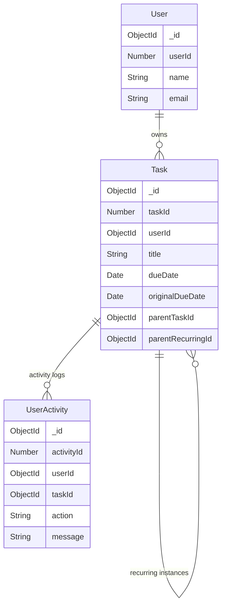

# Enhanced Task Management Data Models

## Overview

This document describes the data models used in the Enhanced Task Management System, including field definitions, validation rules, relationships, and indexes.

## Core Models

### Task Model

The Task model represents individual tasks with support for hierarchical sub-tasks and recurring patterns.

#### Schema Definition

```javascript
const taskSchema = new mongoose.Schema({
  // Auto-incremented internal ID
  taskId: {
    type: Number,
    required: true,
    unique: true,
    index: true
  },
  
  // User ownership
  userId: {
    type: mongoose.Schema.Types.ObjectId,
    required: true,
    ref: 'User',
    index: true
  },
  
  // Basic task information
  title: {
    type: String,
    required: true,
    trim: true,
    minlength: 1,
    maxlength: 200
  },
  
  description: {
    type: String,
    trim: true,
    default: '',
    maxlength: 1000
  },
  
  // Date fields
  dueDate: {
    type: Date,
    required: true,
    index: true
  },
  
  originalDueDate: {
    type: Date,
    required: true,
    immutable: true // Cannot be changed after creation
  },
  
  // Task properties
  priority: {
    type: String,
    enum: ['low', 'medium', 'high'],
    default: 'medium',
    index: true
  },
  
  category: {
    type: String,
    trim: true,
    default: '',
    maxlength: 50,
    index: true
  },
  
  isCompleted: {
    type: Boolean,
    default: false,
    index: true
  },
  
  // Recurrence
  repeatType: {
    type: String,
    enum: ['none', 'daily', 'weekly', 'monthly'],
    default: 'none',
    immutable: true, // Cannot be changed after creation
    index: true
  },
  
  // Hierarchical relationships
  parentTaskId: {
    type: mongoose.Schema.Types.ObjectId,
    ref: 'Task',
    default: null,
    index: true,
    validate: {
      validator: async function(value) {
        if (!value) return true;
        
        // Prevent self-reference
        if (value.equals(this._id)) return false;
        
        // Check if parent exists and belongs to same user
        const parent = await this.constructor.findById(value);
        return parent && parent.userId.equals(this.userId);
      },
      message: 'Parent task must exist and belong to the same user'
    }
  },
  
  // Recurring task relationships
  parentRecurringId: {
    type: mongoose.Schema.Types.ObjectId,
    ref: 'Task',
    default: null,
    index: true
  },
  
  // Additional metadata
  links: [{
    type: String,
    trim: true,
    validate: {
      validator: function(url) {
        return /^https?:\/\/.+/.test(url);
      },
      message: 'Links must be valid URLs starting with http:// or https://'
    }
  }],
  
  additionalNotes: {
    type: String,
    trim: true,
    default: '',
    maxlength: 2000
  }
}, {
  timestamps: true, // Adds createdAt and updatedAt
  versionKey: false
});
```

#### Indexes

```javascript
// Compound indexes for common queries
taskSchema.index({ userId: 1, dueDate: 1 });
taskSchema.index({ userId: 1, isCompleted: 1 });
taskSchema.index({ userId: 1, priority: 1 });
taskSchema.index({ userId: 1, category: 1 });
taskSchema.index({ userId: 1, repeatType: 1 });

// Single field indexes
taskSchema.index({ parentTaskId: 1 });
taskSchema.index({ parentRecurringId: 1 });
taskSchema.index({ taskId: 1 });
```

#### Validation Rules

1. **Sub-task Constraints:**
   - Must have `repeatType` as "none"
   - `dueDate` must be same or before parent task `dueDate`
   - `parentTaskId` must reference existing task owned by same user
   - Cannot reference itself as parent

2. **Recurring Task Constraints:**
   - `repeatType` cannot be changed after creation
   - Sub-tasks cannot have recurring patterns

3. **Field Validation:**
   - `title` is required and must be at least 1 character
   - `links` must be valid URLs
   - `additionalNotes` limited to 2000 characters
   - `originalDueDate` is set automatically and cannot be modified

#### Virtual Fields

```javascript
// Formatted due date
taskSchema.virtual('dueDateFormatted').get(function() {
  return this.dueDate ? this.dueDate.toISOString() : null;
});

// Check if task is overdue
taskSchema.virtual('isOverdue').get(function() {
  if (this.isCompleted) return false;
  return this.dueDate < new Date();
});

// Days until due
taskSchema.virtual('daysUntilDue').get(function() {
  if (this.isCompleted) return 0;
  const now = new Date();
  const due = new Date(this.dueDate);
  const diffTime = due - now;
  return Math.ceil(diffTime / (1000 * 60 * 60 * 24));
});
```

#### Methods

```javascript
// Check if task is overdue
taskSchema.methods.isOverdue = function() {
  if (this.isCompleted) return false;
  return this.dueDate < new Date();
};

// Get days until due
taskSchema.methods.daysUntilDue = function() {
  if (this.isCompleted) return 0;
  const now = new Date();
  const due = new Date(this.dueDate);
  const diffTime = due - now;
  return Math.ceil(diffTime / (1000 * 60 * 60 * 24));
};
```

### User Model

The User model represents system users with auto-incremented IDs and notification preferences.

#### Schema Definition

```javascript
const userSchema = new mongoose.Schema({
  // Auto-incremented internal ID
  userId: {
    type: Number,
    required: true,
    unique: true,
    index: true
  },
  
  // Basic user information
  name: {
    type: String,
    required: true,
    trim: true,
    maxlength: 100
  },
  
  email: {
    type: String,
    required: true,
    trim: true,
    lowercase: true,
    unique: true,
    validate: {
      validator: function(email) {
        return /^[^\s@]+@[^\s@]+\.[^\s@]+$/.test(email);
      },
      message: 'Invalid email format'
    }
  },
  
  password: {
    type: String,
    required: true,
    minlength: 7,
    validate: {
      validator: function(password) {
        return !password.toLowerCase().includes('password');
      },
      message: 'Password cannot contain the word "password"'
    }
  },
  
  // Optional user details
  age: {
    type: Number,
    default: 0,
    min: 0,
    max: 150
  },
  
  // Notification settings
  emailEnabled: {
    type: Boolean,
    default: true
  },
  
  notificationTime: {
    type: String,
    default: "09:00",
    validate: {
      validator: function(time) {
        return /^([01]?[0-9]|2[0-3]):[0-5][0-9]$/.test(time);
      },
      message: 'Time must be in HH:MM format (24-hour)'
    }
  },
  
  // Authentication tokens
  tokens: [{
    token: {
      type: String,
      required: true
    }
  }],
  
  // Profile avatar
  avatar: {
    type: Buffer
  }
}, {
  timestamps: true,
  versionKey: false
});
```

#### Virtual Relationships

```javascript
// Virtual relationship to tasks
userSchema.virtual('tasks', {
  ref: 'Task',
  localField: '_id',
  foreignField: 'userId'
});
```

#### Methods

```javascript
// Generate authentication token
userSchema.methods.generateAuthToken = async function() {
  const user = this;
  const token = jwt.sign({_id: user._id.toString()}, process.env.JWT_SECRET);
  user.tokens = user.tokens.concat({token});
  await user.save();
  return token;
};

// Find user by credentials
userSchema.statics.findByCredentials = async (email, password) => {
  const user = await User.findOne({ email });
  if (!user) {
    throw new Error("Unable to Login");
  }
  const verify = await bcrypt.compare(password, user.password);
  if (!verify) {
    throw new Error("Unable to Login");
  }
  return user;
};

// Transform user object for JSON response
userSchema.methods.toJSON = function() {
  const user = this;
  const userObject = user.toObject();
  delete userObject.password;
  delete userObject.tokens;
  delete userObject.avatar;
  return userObject;
};
```

### UserActivity Model

The UserActivity model tracks all user actions and system events for auditing purposes.

#### Schema Definition

```javascript
const userActivitySchema = new mongoose.Schema({
  // Auto-incremented internal ID
  activityId: {
    type: Number,
    required: true,
    unique: true,
    index: true
  },
  
  // User reference
  userId: {
    type: mongoose.Schema.Types.ObjectId,
    required: true,
    ref: 'User',
    index: true
  },
  
  // Activity details
  action: {
    type: String,
    required: true,
    trim: true,
    index: true,
    maxlength: 100
  },
  
  // Optional task reference
  taskId: {
    type: mongoose.Schema.Types.ObjectId,
    ref: 'Task',
    required: false,
    index: true
  },
  
  // Human-readable message
  message: {
    type: String,
    required: true,
    trim: true,
    maxlength: 500
  },
  
  // Error information (if applicable)
  error: {
    type: String,
    required: false,
    trim: true,
    maxlength: 1000
  },
  
  // Timestamp
  timestamp: {
    type: Date,
    default: Date.now,
    index: true
  }
}, {
  versionKey: false
});
```

#### Indexes

```javascript
// Compound indexes for efficient queries
userActivitySchema.index({ userId: 1, timestamp: -1 });
userActivitySchema.index({ userId: 1, action: 1 });
userActivitySchema.index({ userId: 1, action: 1, timestamp: -1 });
```

#### Common Activity Types

```javascript
const ACTIVITY_TYPES = {
  // Task operations
  TASK_CREATED: 'TASK_CREATED',
  TASK_UPDATED: 'TASK_UPDATED',
  TASK_COMPLETED: 'TASK_COMPLETED',
  TASK_DELETED: 'TASK_DELETED',
  
  // Recurring task operations
  RECURRING_TASK_CREATED: 'RECURRING_TASK_CREATED',
  RECURRING_TASK_UPDATED: 'RECURRING_TASK_UPDATED',
  RECURRING_TASKS_DELETED: 'RECURRING_TASKS_DELETED',
  
  // System operations
  ORPHANED_RECURRING_TASK_CLEANED: 'ORPHANED_RECURRING_TASK_CLEANED',
  
  // Worker failures
  WORKER_CREATE_FAILED: 'WORKER_CREATE_FAILED',
  WORKER_COMPLETE_FAILED: 'WORKER_COMPLETE_FAILED',
  WORKER_DELETE_FAILED: 'WORKER_DELETE_FAILED',
  
  // User operations
  USER_LOGIN: 'USER_LOGIN',
  USER_LOGOUT: 'USER_LOGOUT',
  PROFILE_UPDATED: 'PROFILE_UPDATED'
};
```

### Counter Model

The Counter model manages auto-incremented IDs for all collections.

#### Schema Definition

```javascript
const counterSchema = new mongoose.Schema({
  // Collection name as ID
  _id: {
    type: String,
    required: true
  },
  
  // Current sequence value
  sequence_value: {
    type: Number,
    default: 1,
    min: 1
  }
}, {
  versionKey: false
});
```

#### Usage Examples

```javascript
// Counter documents
{
  "_id": "tasks",
  "sequence_value": 105
}

{
  "_id": "users", 
  "sequence_value": 23
}

{
  "_id": "useractivities",
  "sequence_value": 1247
}
```

## Relationships

### Task Relationships



### Hierarchical Task Structure

```
Project Task (taskId: 1)
├── Frontend Development (taskId: 2, parentTaskId: 1)
│   ├── Design Components (taskId: 3, parentTaskId: 2)
│   └── Implement UI (taskId: 4, parentTaskId: 2)
└── Backend Development (taskId: 5, parentTaskId: 1)
    ├── API Design (taskId: 6, parentTaskId: 5)
    └── Database Schema (taskId: 7, parentTaskId: 5)
```

### Recurring Task Structure

```
Original Task (taskId: 1, repeatType: "daily")
├── Instance 1 (taskId: 8, parentRecurringId: 1, dueDate: tomorrow)
├── Instance 2 (taskId: 9, parentRecurringId: 1, dueDate: day after tomorrow)
└── Instance 3 (taskId: 10, parentRecurringId: 1, dueDate: 3 days from now)
```

## Data Integrity Rules

### Task Constraints

1. **Sub-task Rules:**
   - Sub-tasks cannot have `repeatType` other than "none"
   - Sub-task `dueDate` must be ≤ parent task `dueDate`
   - `parentTaskId` must reference existing task owned by same user
   - No circular references allowed

2. **Recurring Task Rules:**
   - `repeatType` cannot be changed after creation
   - Only original tasks can have `repeatType` ≠ "none"
   - Recurring instances have `parentRecurringId` pointing to original

3. **Date Rules:**
   - `originalDueDate` is immutable after creation
   - `dueDate` can be modified but affects sub-task validation

### User Constraints

1. **Email Uniqueness:** Each email can only be associated with one user
2. **Password Security:** Passwords are hashed using bcrypt
3. **Token Management:** JWT tokens are stored for session management

### Activity Logging Rules

1. **Referential Integrity:** Activities can reference deleted tasks/users
2. **Immutable Records:** Activity logs cannot be modified after creation
3. **Automatic Cleanup:** Old activities may be archived based on retention policy

## Performance Considerations

### Indexing Strategy

1. **Compound Indexes:** Optimized for common query patterns
2. **Single Field Indexes:** For unique constraints and frequent filters
3. **Sparse Indexes:** For optional fields with high selectivity

### Query Optimization

1. **Task Queries:**
   - Use `userId` in all task queries for security and performance
   - Leverage compound indexes for filtering and sorting
   - Use projection to limit returned fields

2. **Activity Queries:**
   - Query by `userId` and `timestamp` for user activity feeds
   - Use `action` field for filtering specific activity types

3. **Counter Operations:**
   - Atomic operations using `findOneAndUpdate` with `$inc`
   - Upsert option for automatic counter initialization

### Scaling Considerations

1. **Sharding:** Consider sharding by `userId` for horizontal scaling
2. **Read Replicas:** Use read replicas for activity log queries
3. **Archiving:** Implement archiving strategy for old activities
4. **Caching:** Cache frequently accessed user and task data

## Migration Scripts

### Adding New Fields

```javascript
// Example migration for adding originalDueDate field
db.tasks.updateMany(
  { originalDueDate: { $exists: false } },
  [{ $set: { originalDueDate: "$dueDate" } }]
);
```

### Counter Initialization

```javascript
// Initialize counters for existing collections
const collections = ['tasks', 'users', 'useractivities'];

for (const collection of collections) {
  const count = await db[collection].countDocuments();
  await db.counters.updateOne(
    { _id: collection },
    { $setOnInsert: { sequence_value: count + 1 } },
    { upsert: true }
  );
}
```

## Backup and Recovery

### Backup Strategy

1. **Full Backups:** Daily full database backups
2. **Incremental Backups:** Hourly incremental backups
3. **Point-in-Time Recovery:** Enable oplog for point-in-time recovery

### Critical Collections

1. **Tasks:** Core business data
2. **Users:** Authentication and user data
3. **Counters:** Essential for ID generation
4. **UserActivities:** Audit trail (can be archived)

### Recovery Procedures

1. **Data Corruption:** Restore from latest backup
2. **Counter Corruption:** Recalculate sequence values from existing data
3. **Partial Loss:** Use activity logs to reconstruct missing data

## Monitoring and Maintenance

### Key Metrics

1. **Task Metrics:**
   - Total tasks created per day
   - Task completion rate
   - Overdue task percentage
   - Recurring task processing success rate

2. **Performance Metrics:**
   - Query response times
   - Index usage statistics
   - Counter generation performance

3. **Data Quality Metrics:**
   - Orphaned task count
   - Invalid reference count
   - Data consistency checks

### Maintenance Tasks

1. **Daily:**
   - Orphaned task cleanup
   - Activity log archiving
   - Performance metric collection

2. **Weekly:**
   - Index optimization
   - Data consistency validation
   - Backup verification

3. **Monthly:**
   - Schema evolution planning
   - Capacity planning review
   - Archive old activity logs