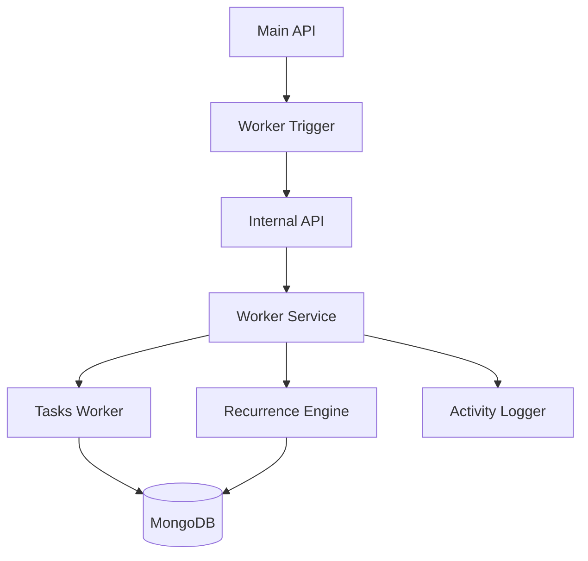
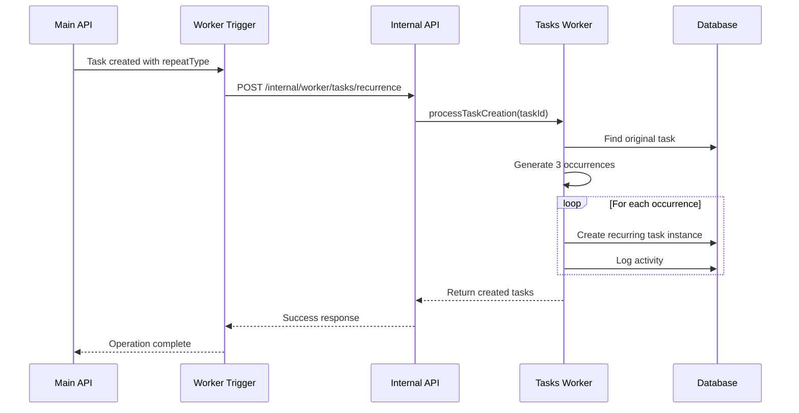

# Background Worker System Documentation

## Overview

The Background Worker System handles automated processing of recurring tasks, maintenance operations, and other background jobs in the Enhanced Task Management System. It operates independently of the main API to ensure non-blocking performance and reliable task automation.

## Architecture

### System Components



### Component Responsibilities

1. **Worker Trigger** (`src/utils/workerTrigger.js`)
   - Makes HTTP calls to internal worker API
   - Implements retry logic for failed operations
   - Provides graceful degradation

2. **Internal API** (`src/routers/internal.js`)
   - Secure endpoints for worker operations
   - Request validation and authentication
   - Error handling and logging

3. **Worker Service** (`src/workers/workerService.js`)
   - Unified interface for all worker operations
   - Error handling and recovery
   - Health monitoring and statistics

4. **Tasks Worker** (`src/workers/tasksWorker.js`)
   - Core recurring task processing logic
   - Task creation, completion, and deletion handling
   - Orphaned task cleanup

5. **Recurrence Engine** (`src/workers/recurrenceEngine.js`)
   - Date calculation for recurring patterns
   - Validation of recurrence rules
   - Edge case handling (month-end, leap years)

## Worker Operations

### Task Creation Processing

When a recurring task is created, the worker system:

1. **Validates** the task's recurrence configuration
2. **Generates** the next 3 recurring occurrences
3. **Creates** task instances in the database
4. **Logs** activity for each created instance

```javascript
// Example: Daily recurring task
Original Task: "Daily Standup" (due: 2024-02-01 09:00)
Generated Instances:
- Instance 1: due 2024-02-02 09:00
- Instance 2: due 2024-02-03 09:00  
- Instance 3: due 2024-02-04 09:00
```

#### Implementation Flow



### Task Completion Processing

When a recurring task is completed:

1. **Finds** the next occurrence in the sequence
2. **Updates** its `parentRecurringId` to link to original
3. **Generates** a new third occurrence to maintain 3 future instances
4. **Logs** completion and creation activities

```javascript
// Example: Weekly recurring task completion
Completed: "Weekly Review" (due: 2024-02-01)
Next occurrence: "Weekly Review" (due: 2024-02-08) 
  -> parentRecurringId set to original task ID
New occurrence created: "Weekly Review" (due: 2024-02-22)
```

### Task Deletion Processing

When a recurring task is deleted:

1. **Identifies** all related recurring instances
2. **Deletes** all tasks with matching `parentRecurringId`
3. **Logs** cascade deletion activity
4. **Returns** count of deleted instances

```javascript
// Example: Monthly recurring task deletion
Deleted: "Monthly Report" (original task)
Cascade deleted:
- "Monthly Report" (due: 2024-03-01)
- "Monthly Report" (due: 2024-04-01)
- "Monthly Report" (due: 2024-05-01)
Total deleted: 3 instances
```

## Recurrence Engine

### Supported Patterns

#### Daily Recurrence
- **Rule**: Add 1 day to the base date
- **Example**: 2024-02-01 → 2024-02-02 → 2024-02-03

#### Weekly Recurrence  
- **Rule**: Add 7 days to the base date
- **Example**: 2024-02-01 → 2024-02-08 → 2024-02-15

#### Monthly Recurrence
- **Rule**: Add 1 month, handling month-end edge cases
- **Examples**:
  - 2024-01-15 → 2024-02-15 → 2024-03-15
  - 2024-01-31 → 2024-02-29 → 2024-03-31 (leap year)
  - 2023-01-31 → 2023-02-28 → 2023-03-31 (non-leap year)

### Edge Case Handling

#### Month-End Dates
```javascript
// January 31st in leap year
const jan31 = new Date('2024-01-31T10:00:00Z');
const feb29 = RecurrenceEngine.calculateNextOccurrence(jan31, 'monthly');
// Result: 2024-02-29 (last day of February in leap year)

// January 31st in non-leap year  
const jan31NonLeap = new Date('2023-01-31T10:00:00Z');
const feb28 = RecurrenceEngine.calculateNextOccurrence(jan31NonLeap, 'monthly');
// Result: 2023-02-28 (last day of February in non-leap year)
```

#### Daylight Saving Time
The system preserves the original time when crossing DST boundaries:

```javascript
// Spring forward: 2024-03-10 02:00 → 2024-04-10 02:00
// Fall back: 2024-11-03 02:00 → 2024-12-03 02:00
```

### Validation Rules

#### Task Validation
```javascript
const validationRules = {
  // Sub-tasks cannot be recurring
  subTaskRecurrence: (task) => {
    if (task.parentTaskId && task.repeatType !== 'none') {
      throw new Error('Sub-tasks cannot have recurring patterns');
    }
  },
  
  // Due date cannot be too far in the past
  pastDueDate: (task) => {
    const oneDayAgo = new Date(Date.now() - 24 * 60 * 60 * 1000);
    if (task.dueDate < oneDayAgo) {
      throw new Error('Due date should not be more than 1 day in the past');
    }
  },
  
  // Valid repeat type
  repeatType: (task) => {
    const validTypes = ['none', 'daily', 'weekly', 'monthly'];
    if (!validTypes.includes(task.repeatType)) {
      throw new Error(`Invalid repeat type: ${task.repeatType}`);
    }
  }
};
```

## Internal API

### Security

#### Access Control
```javascript
const internalAuth = (req, res, next) => {
  const clientIP = req.ip || req.connection.remoteAddress;
  const isLocalhost = ['127.0.0.1', '::1', '::ffff:127.0.0.1'].includes(clientIP);
  
  const internalApiKey = process.env.INTERNAL_API_KEY;
  const providedKey = req.headers['x-internal-api-key'];
  
  if (internalApiKey && providedKey !== internalApiKey) {
    return res.status(403).json({
      error: 'Forbidden',
      message: 'Invalid internal API key'
    });
  }
  
  if (!isLocalhost && !internalApiKey) {
    return res.status(403).json({
      error: 'Forbidden', 
      message: 'Internal API access restricted'
    });
  }
  
  next();
};
```

#### Environment Configuration
```bash
# Optional: Set internal API key for additional security
INTERNAL_API_KEY=your-secret-key-here

# Required: Set JWT secret for token validation
JWT_SECRET=your-jwt-secret

# Optional: Configure allowed origins for CORS
ALLOWED_ORIGINS=http://localhost:3000,http://localhost:3001
```

### Endpoints

#### Process Task Recurrence
```http
POST /internal/worker/tasks/recurrence
Content-Type: application/json
x-internal-api-key: your-secret-key

{
  "taskId": "65b1234567890abcdef12345",
  "operation": "create", // "create" | "complete" | "delete"
  "userId": "65b1234567890abcdef12340" // Required for delete
}
```

**Response:**
```json
{
  "success": true,
  "message": "Successfully processed create for task 65b1234567890abcdef12345",
  "data": {
    "success": true,
    "operation": "create",
    "taskId": "65b1234567890abcdef12345",
    "result": [
      {
        "_id": "65b1234567890abcdef12346",
        "title": "Daily Standup",
        "dueDate": "2024-02-02T09:00:00.000Z",
        "parentRecurringId": "65b1234567890abcdef12345"
      }
      // ... 2 more instances
    ]
  }
}
```

#### Cleanup Operations
```http
POST /internal/worker/tasks/cleanup
x-internal-api-key: your-secret-key
```

**Response:**
```json
{
  "success": true,
  "message": "Cleanup operations completed successfully",
  "data": {
    "timestamp": "2024-02-01T10:00:00.000Z",
    "operations": {
      "orphanedTasksCleanup": {
        "completed": true,
        "cleanedCount": 5
      }
    },
    "success": true
  }
}
```

#### Health Check
```http
GET /internal/worker/health
x-internal-api-key: your-secret-key
```

**Response:**
```json
{
  "success": true,
  "data": {
    "status": "healthy",
    "timestamp": "2024-02-01T10:00:00.000Z",
    "services": {
      "tasksWorker": "operational",
      "recurrenceEngine": "operational"
    },
    "stats": {
      "totalTasks": 1250,
      "recurringTasks": 85,
      "recurringInstances": 255,
      "dailyRecurring": 45,
      "weeklyRecurring": 25,
      "monthlyRecurring": 15
    }
  }
}
```

#### Statistics
```http
GET /internal/worker/stats?userId=65b1234567890abcdef12340
x-internal-api-key: your-secret-key
```

#### Validate Recurrence
```http
POST /internal/worker/validate
Content-Type: application/json
x-internal-api-key: your-secret-key

{
  "task": {
    "title": "Test Task",
    "dueDate": "2024-02-15T10:00:00.000Z",
    "repeatType": "daily"
  }
}
```

## Worker Triggers

### Integration with Main API

Worker triggers are integrated into the main API routes to ensure background processing occurs automatically:

```javascript
// Task creation with worker trigger
router.post("/tasks", auth, async (req, res) => {
  const task = new Task({ ...req.body, userId: req.user._id });
  
  try {
    await task.save();
    
    // Trigger worker processing (non-blocking)
    if (task.repeatType && task.repeatType !== 'none') {
      WorkerTrigger.safeTrigger(
        WorkerTrigger.triggerTaskCreation, 
        task._id.toString()
      ).catch(err => {
        console.error('Failed to trigger task creation worker:', err);
      });
    }
    
    res.status(201).send(task);
  } catch (e) {
    res.status(400).send(e);
  }
});
```

### Retry Logic

Worker triggers implement exponential backoff retry logic:

```javascript
const response = await ErrorHandler.retry(
  () => axios.post(url, payload, {
    headers: this.getInternalHeaders(),
    timeout: 10000
  }),
  2, // Max 2 retries
  500 // 500ms initial delay
);
```

### Graceful Degradation

Worker failures don't break the main API flow:

```javascript
// Safe trigger wrapper
static async safeTrigger(triggerFunction, ...args) {
  try {
    return await triggerFunction.apply(this, args);
  } catch (error) {
    console.error('WorkerTrigger: Safe trigger failed:', error.message);
    return null; // Don't throw, just log and return null
  }
}
```

## Error Handling and Recovery

### Error Types

#### Transient Errors
- Network timeouts
- Database connection issues
- Temporary service unavailability

**Recovery Strategy**: Automatic retry with exponential backoff

#### Permanent Errors
- Invalid task data
- Missing parent tasks
- Validation failures

**Recovery Strategy**: Log error and skip processing

#### Partial Failures
- Some recurring instances created, others failed
- Database inconsistency

**Recovery Strategy**: Cleanup incomplete operations, log for manual review

### Error Logging

All worker errors are logged with context:

```javascript
{
  "timestamp": "2024-02-01T10:00:00.000Z",
  "level": "error",
  "service": "TasksWorker",
  "operation": "processTaskCreation",
  "taskId": "65b1234567890abcdef12345",
  "userId": "65b1234567890abcdef12340",
  "error": "Failed to generate recurring instances",
  "details": {
    "originalError": "Database connection timeout",
    "retryAttempt": 2,
    "maxRetries": 3
  }
}
```

### Recovery Procedures

#### Orphaned Task Cleanup
```javascript
// Automatic cleanup of orphaned recurring tasks
const cleanupResult = await TasksWorker.cleanupOrphanedRecurringTasks();
console.log(`Cleaned up ${cleanupResult} orphaned tasks`);
```

#### Manual Recovery
```javascript
// Manual recovery for specific task
const taskId = "65b1234567890abcdef12345";
const userId = "65b1234567890abcdef12340";

try {
  // Retry failed operation
  await WorkerService.processTaskRecurrence(taskId, 'create');
} catch (error) {
  // Log for manual intervention
  console.error(`Manual recovery needed for task ${taskId}:`, error);
}
```

## Monitoring and Maintenance

### Health Monitoring

#### Service Health Checks
```javascript
const health = await WorkerService.getHealthStatus();

if (health.status !== 'healthy') {
  // Alert system administrators
  alerting.sendAlert({
    severity: 'high',
    message: `Worker service unhealthy: ${health.error}`,
    timestamp: new Date()
  });
}
```

#### Performance Metrics
```javascript
const metrics = {
  // Processing times
  avgProcessingTime: 150, // milliseconds
  maxProcessingTime: 2000,
  
  // Success rates
  successRate: 99.5, // percentage
  retryRate: 2.1,
  
  // Volume metrics
  tasksProcessedPerHour: 450,
  recurringInstancesCreated: 1350,
  
  // Error rates
  errorRate: 0.5, // percentage
  timeoutRate: 0.1
};
```

### Maintenance Operations

#### Daily Maintenance
```javascript
// Run daily at 2:00 AM
const dailyMaintenance = async () => {
  try {
    // Clean up orphaned tasks
    const cleanedCount = await TasksWorker.cleanupOrphanedRecurringTasks();
    
    // Generate health report
    const health = await WorkerService.getHealthStatus();
    
    // Archive old activity logs (if needed)
    // await archiveOldActivities();
    
    console.log(`Daily maintenance completed: ${cleanedCount} tasks cleaned`);
  } catch (error) {
    console.error('Daily maintenance failed:', error);
  }
};
```

#### Weekly Maintenance
```javascript
// Run weekly on Sunday at 3:00 AM
const weeklyMaintenance = async () => {
  try {
    // Validate data consistency
    await validateRecurringTaskConsistency();
    
    // Generate performance report
    const stats = await WorkerService.getDetailedStats();
    
    // Check for performance degradation
    if (stats.avgProcessingTime > 1000) {
      alerting.sendAlert({
        severity: 'medium',
        message: 'Worker performance degradation detected'
      });
    }
    
    console.log('Weekly maintenance completed');
  } catch (error) {
    console.error('Weekly maintenance failed:', error);
  }
};
```

### Troubleshooting Guide

#### Common Issues

**Issue**: Recurring tasks not being created
```bash
# Check worker service health
curl -H "x-internal-api-key: your-key" http://localhost:3000/internal/worker/health

# Check recent error logs
grep "TasksWorker.*ERROR" /var/log/app.log | tail -20

# Manually trigger task processing
curl -X POST -H "Content-Type: application/json" \
     -H "x-internal-api-key: your-key" \
     -d '{"taskId":"TASK_ID","operation":"create"}' \
     http://localhost:3000/internal/worker/tasks/recurrence
```

**Issue**: High error rate in worker processing
```bash
# Check database connectivity
mongo --eval "db.adminCommand('ping')"

# Check system resources
top -p $(pgrep node)
df -h

# Review error patterns
grep "WorkerService.*Failed" /var/log/app.log | cut -d' ' -f5- | sort | uniq -c
```

**Issue**: Orphaned recurring tasks accumulating
```bash
# Run cleanup manually
curl -X POST -H "x-internal-api-key: your-key" \
     http://localhost:3000/internal/worker/tasks/cleanup

# Check cleanup results
mongo task-app --eval "
  db.tasks.find({
    parentRecurringId: {\$ne: null},
    parentRecurringId: {\$nin: db.tasks.distinct('_id')}
  }).count()
"
```

#### Performance Optimization

**Database Optimization**:
```javascript
// Ensure proper indexes exist
db.tasks.createIndex({ "parentRecurringId": 1 });
db.tasks.createIndex({ "userId": 1, "repeatType": 1 });
db.tasks.createIndex({ "userId": 1, "dueDate": 1 });
```

**Worker Optimization**:
```javascript
// Batch processing for multiple tasks
const batchSize = 10;
const tasks = await Task.find({ repeatType: { $ne: 'none' } }).limit(batchSize);

const promises = tasks.map(task => 
  WorkerService.processTaskRecurrence(task._id.toString(), 'create')
);

await Promise.all(promises);
```

## Configuration

### Environment Variables

```bash
# Worker system configuration
INTERNAL_API_KEY=your-secret-internal-key
WORKER_RETRY_ATTEMPTS=3
WORKER_RETRY_DELAY=500
WORKER_TIMEOUT=10000

# Database configuration
MONGODB_URL=mongodb://localhost:27017/task-app
MONGODB_POOL_SIZE=10

# Logging configuration
LOG_LEVEL=info
LOG_FILE=/var/log/task-app/worker.log

# Maintenance schedule
DAILY_MAINTENANCE_TIME=02:00
WEEKLY_MAINTENANCE_DAY=sunday
WEEKLY_MAINTENANCE_TIME=03:00
```

### Production Deployment

#### Docker Configuration
```dockerfile
# Worker service container
FROM node:18-alpine

WORKDIR /app
COPY package*.json ./
RUN npm ci --only=production

COPY src/ ./src/
COPY documentation/ ./documentation/

EXPOSE 3000

# Health check
HEALTHCHECK --interval=30s --timeout=3s --start-period=5s --retries=3 \
  CMD curl -f http://localhost:3000/internal/worker/health || exit 1

CMD ["node", "src/index.js"]
```

#### Process Management
```yaml
# PM2 ecosystem file
apps:
  - name: task-app-main
    script: src/index.js
    instances: 2
    exec_mode: cluster
    env:
      NODE_ENV: production
      PORT: 3000
      
  - name: task-app-worker-monitor
    script: scripts/worker-monitor.js
    instances: 1
    cron_restart: "0 2 * * *" # Daily restart at 2 AM
```

#### Monitoring Setup
```yaml
# Prometheus metrics
version: '3.8'
services:
  app:
    image: task-app:latest
    ports:
      - "3000:3000"
    environment:
      - PROMETHEUS_METRICS=true
      - METRICS_PORT=9090
      
  prometheus:
    image: prom/prometheus
    ports:
      - "9090:9090"
    volumes:
      - ./prometheus.yml:/etc/prometheus/prometheus.yml
```

This comprehensive documentation provides everything needed to understand, deploy, monitor, and maintain the background worker system.