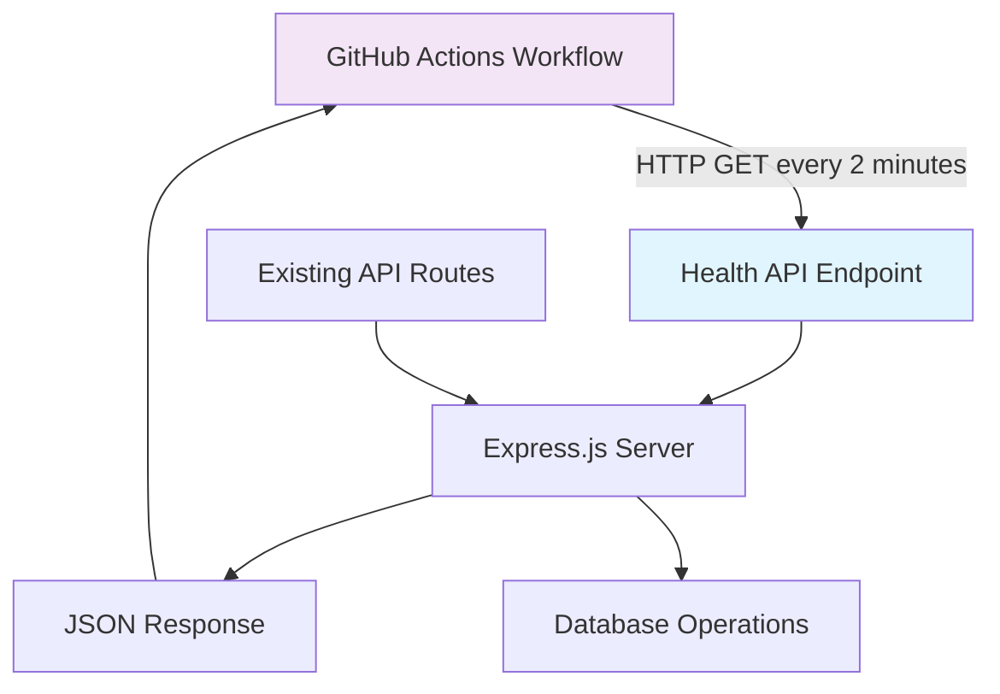

# Design Document

## Overview

The service keepalive system consists of two main components:
1. A lightweight health API endpoint integrated into the existing Express.js backend
2. A GitHub Actions workflow that automatically pings the health endpoint every 2 minutes

This design ensures the Render free tier service remains active without consuming significant resources or affecting existing functionality.

## Architecture



The health endpoint operates independently of the existing API infrastructure, ensuring no interference with current operations while maintaining service activity.

## Components and Interfaces

### Health API Endpoint

**Route:** `GET /health`
**Location:** New router file `backend/src/routers/health.js`
**Integration:** Added to main Express app in `backend/src/index.js`

**Response Format:**
```json
{
  "status": "ok",
  "timestamp": "2025-01-13T10:30:00.000Z",
  "uptime": 3600.5,
  "service": "task-app"
}
```

**Key Design Decisions:**
- No database connectivity required - purely in-memory response
- Minimal processing to ensure sub-100ms response times
- Standard HTTP status codes (200 for success)
- Includes uptime for basic service monitoring

### GitHub Actions Workflow

**File:** `.github/workflows/keepalive.yml`
**Schedule:** Every 2 minutes using cron expression `*/2 * * * *`
**Trigger:** Scheduled execution only (no manual triggers needed)

**Workflow Steps:**
1. Checkout repository (minimal, no dependencies needed)
2. Make HTTP GET request to health endpoint
3. Log response status and timestamp
4. Handle failures gracefully without stopping workflow

**Environment Variables:**
- `SERVICE_URL`: Repository secret containing the production service URL
- Fallback to default localhost for development testing

## Data Models

### Health Response Model
```javascript
{
  status: String,      // "ok" | "error"
  timestamp: String,   // ISO 8601 timestamp
  uptime: Number,      // Process uptime in seconds
  service: String      // Service identifier
}
```

No persistent data storage required - all data is computed at request time.

## Error Handling

### Health Endpoint Error Handling
- **Server Errors:** Return 500 status with error details in development, generic message in production
- **Invalid Requests:** Return 405 for non-GET methods
- **Timeout Protection:** Express.js default timeout handling sufficient

### GitHub Actions Error Handling
- **Network Failures:** Log error, continue workflow execution
- **HTTP Errors:** Log status code and response, continue workflow
- **Workflow Failures:** GitHub Actions built-in retry mechanism
- **Rate Limiting:** Respect GitHub Actions limits (no more frequent than every 2 minutes)

### Error Response Format
```json
{
  "status": "error",
  "timestamp": "2025-01-13T10:30:00.000Z",
  "message": "Service temporarily unavailable"
}
```

## Testing Strategy

### Health Endpoint Testing
1. **Unit Tests:** Test response format, status codes, and timing
2. **Integration Tests:** Verify endpoint works within Express app context
3. **Load Tests:** Ensure endpoint handles multiple concurrent requests
4. **Response Time Tests:** Verify sub-100ms response requirement

### GitHub Actions Testing
1. **Workflow Validation:** Test YAML syntax and structure
2. **Local Testing:** Use `act` tool to test workflow locally
3. **Staging Tests:** Test against development environment first
4. **Production Validation:** Monitor initial runs for success/failure patterns

### Test Scenarios
- Health endpoint returns correct JSON format
- Health endpoint responds within time limits
- GitHub Actions workflow executes on schedule
- Workflow handles network failures gracefully
- Multiple concurrent health checks don't interfere
- Service stays active during extended periods

## Implementation Considerations

### Performance
- Health endpoint uses minimal CPU/memory
- No database queries or external API calls
- Response caching not needed due to dynamic timestamp
- Concurrent request handling via Express.js built-in capabilities

### Security
- No authentication required for health endpoint
- No sensitive data exposed in responses
- GitHub Actions uses repository secrets for service URL
- CORS headers already handled by existing middleware

### Monitoring
- GitHub Actions provides built-in execution logs
- Health endpoint responses include uptime for basic monitoring
- Existing server logging captures health endpoint requests
- No additional monitoring infrastructure required

### Scalability
- Health endpoint scales with existing Express.js server
- GitHub Actions workflow is stateless and independent
- No additional infrastructure or dependencies required
- Can easily adjust ping frequency by modifying cron schedule